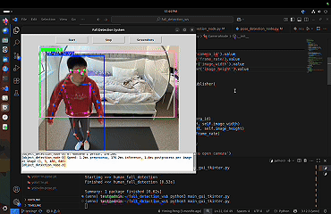
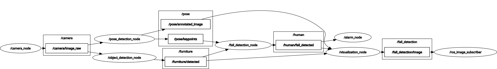
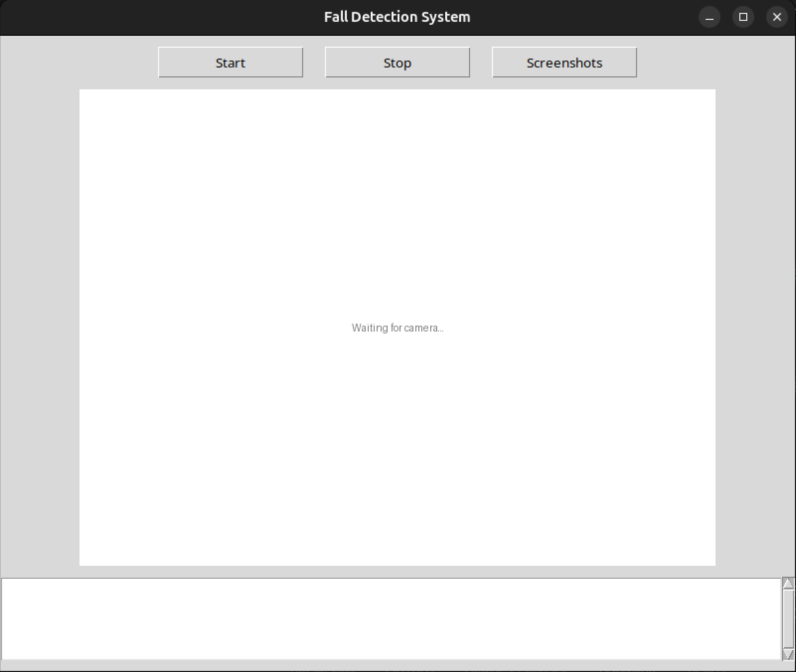
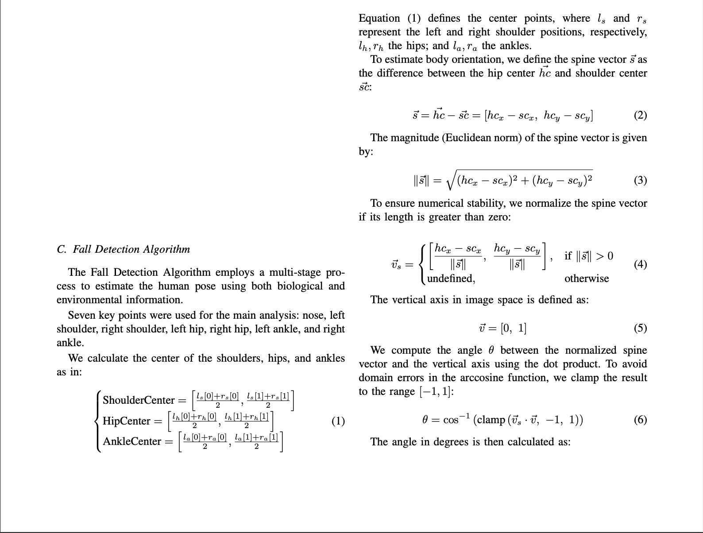
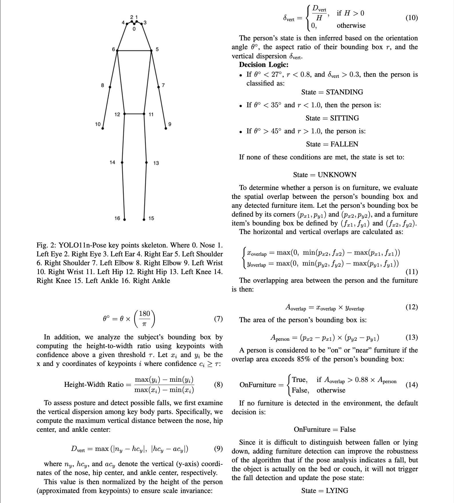
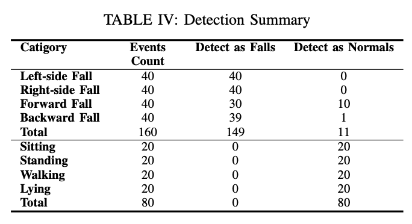
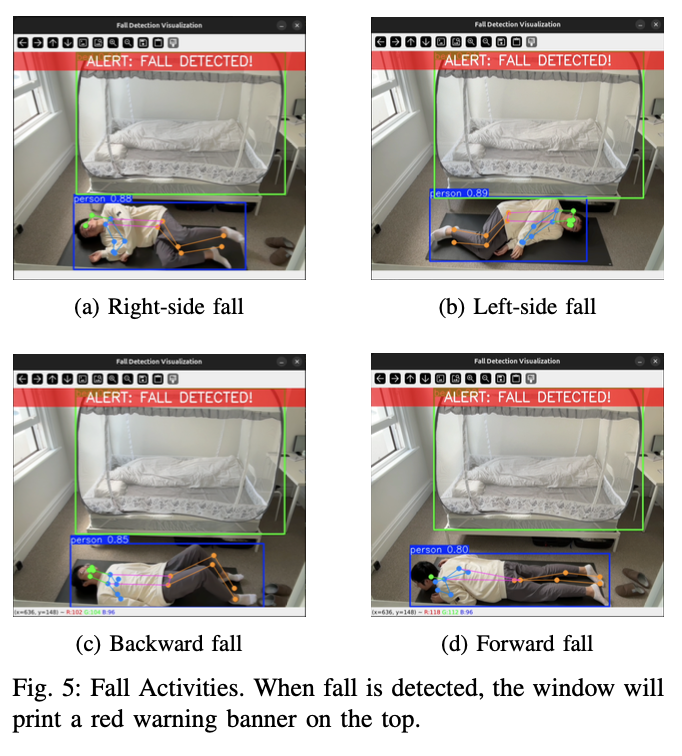
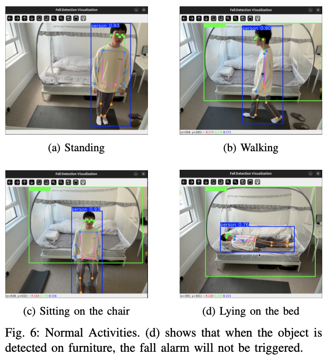
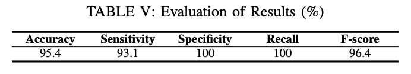

# ROS 2 Human Fall Detection System

This project is a real-time human fall detection system built using ROS 2, Python, OpenCV, and the YOLO11n-pose estimation model. It captures video from a camera, analyzes human poses to detect falls, and provides a simple Tkinter-based GUI for control and monitoring.

## Features

*   **Real-time Pose Estimation**: Utilizes the YOLO11n-pose model to detect human keypoints in a video stream.
*   **Furniture Detection**: Utilizes the YOLO11n model to detect furnitures like bed, couch, and bench.
*   **Fall Detection Logic**: Implements a custom algorithm to classify a person's state (Standing, Sitting, Lying, Fallen) based on spine angle, body aspect ratio, and keypoint dispersion.
*   **ROS 2 Integration**: The system is modularized into several ROS 2 nodes for camera input, pose processing, and fall analysis.
*   **Graphical User Interface (GUI)**: A simple Tkinter GUI allows users to easily start and stop the detection process, view the annotated video feed, and see log messages.
*   **Event Logging**: Logs fall detection events with relevant details.
*   **Screenshot on Fall**: Automatically saves a screenshot when a fall is confirmed.

<p align="center">
  
</p>
The GIF above demonstrates how the system detects a fall. The current FPS is displayed in the top-left corner. The subject is enclosed in a blue bounding box along with human body keypoints, while furniture (e.g., a bed) is enclosed in a green bounding box. When a fall is detected, a red banner appears at the top of the screen displaying the message "ALERT: FALL DETECTED!" accompanied by an alarm sound. The alarm sound file can be customized by modifying the corresponding entry in the `params.yaml` file of the `alarm node`.
## System Architecture

The system consists of several ROS 2 nodes that communicate via topics. The nodes are in `fall_detection_ws/src/human_fall_detection/human_fall_detection/`. The params can be adjusted in `fall_detection_ws/src/human_fall_detection/config/`

The launch file is in `fall_detection_ws/src/human_fall_detection/launch/`.

GUI file is in `fall_detection_ws/main_gui.tkinter.py`

1.  **`camera_node`**: Captures frames from a webcam and publishes them to the `camera/image_raw` topic.
2.  **`pose_detection_node`**: Subscribes to `camera/image_raw`, runs the YOLO model on the frames, and publishes the detected keypoints to `pose/keypoints` and an annotated image to `pose/annotated_image`.
3.  **`object_detection_node`**: Subscribes to `camera/image_raw`, runs the YOLO11n model on the frames, and publishes the detected furnitures to `furniture/detected`. The furnitures are specified to only detect 3 different types: bed, couch, and bench from COCO dataset.
4.  **`fall_detection_node`**: Subscribes to `pose/keypoints`, analyzes the pose data to determine the person's state, and publishes fall alerts.
5.  **`visualization_node`**: Subscribes to `pose/annotated_image`, `furniture/detected`, `human/fall_detected` and publishes `/fall_detection/image` for the visualization.
6.  **`alarm_node`**: Subscribes to `human/fall_detected` to play the alert sound.
7.  **`main_gui_tkinter.py`**: A standalone application that:
    *   Provides "Start" and "Stop" buttons to launch and terminate the ROS 2 nodes.
    *   Subscribes to `pose/annotated_image` to display the video feed.
    *   Displays log output from the ROS nodes.


## Prerequisites
This fall detection system was tested on these environment and requirements:
*   Macbook Pro with M3 Pro chip
*   VMware Fusion Professional Version 13.6.3 (24585314)
*   Ubuntu 64-bit Arm Server 24.04, with GNOME Shell 46.0
*   5 processor cores, with 4608 MB Memory, 64 GB Disk (optional)
*   ROS 2 Jazzy Jalisco
*   Vertual environment with Python 3.12

## Installation

1.  **Clone the Workspace**:
    If you haven't already, place the project into a ROS 2 workspace directory.
    ```bash
    mkdir -p ~/fall_detection_ws/src
    mv /path/to/your/human_fall_detection ~/fall_detection_ws/src/
    ```

2.  **Create the Virtual Environment**:
    Due to the venv is too big so I can't upload it to github. So you need to create a venv by yourself.

2.  **Install Python Dependencies**:
    Navigate to your workspace root and install the required Python packages using the `requirements.txt` file.
    ```bash
    cd ~/fall_detection_ws
    pip install -r requirements.txt
    ```

3.  **Build the ROS 2 Workspace**:
    Source your main ROS 2 environment and build the package using `colcon`.
    ```bash
    source /opt/ros/jazzy/setup.bash
    colcon build
    ```

## How to Run

The easiest way to run the system is through the provided GUI.

1.  **Source the Workspace**:
    Before running, you must source the local setup file of your workspace. Open a new terminal for this. (Optional – runs automatically after step 2.)
    ```bash
    cd ~/fall_detection_ws
    source install/setup.bash
    ```

2.  **Launch the GUI**:
    Run the main Tkinter application script.
    ```bash
    python3 main_gui_tkinter.py
    ```

<p align="center">
  
</p>

3.  **Using the GUI**:
    *   **Start**: Click the "Start" button to launch all the necessary ROS 2 nodes. The video feed and logs will appear in the window.
    *   **Stop**: Click the "Stop" button to terminate the detection process.
    *   **Screenshots**: Click this button to open the `~/fall_detection_ws/screenshots` folder where images of detected falls are saved.

## Running Nodes Manually (Alternative)

You can also run the ROS 2 launch file directly without the GUI.

1.  **Uncomment line 167-170 in visulization_node.py**
    ```python
    # Display the visualization
    if self.display_output:
        cv2.imshow('Fall Detection Visualization', display_image)
        cv2.waitKey(1)
    ```


2.  **Source the Workspace**:
    ```bash
    cd ~/fall_detection_ws
    source install/setup.bash
    ```

3.  **Run the Launch File**:
    ```bash
    ros2 launch human_fall_detection fall_detection.launch.py
    ```

## Fall Detection Algorithm



## Troubleshooting
### 1. To install Ubuntu GUI on a ARM Mac using VMware
[Video Guide: 【MacBook使用UTM安装ubuntu操作系统】](https://www.bilibili.com/video/BV1SwB8YqEia/?share_source=copy_web&vd_source=2d41dd1d327971e94cab3647818bc2d2)

After installing the Ubuntu Server, run:
```bash
sudo apt-get update;
sudo apt-get install python3;
sudo apt-get install xinit;
sudo apt-get install ubuntu-desktop;
```
### 2. To access clipboard and camera in VMware:
```bash
sudo apt update
sudo apt install open-vm-tools open-vm-tools-desktop
sudo reboot
sudo usermod -aG video $USER
```

### 3. If use a virtual environment, ros2 can't recognize the side packages in the venv automatically. To solve this:
```bash
export PYTHONPATH=$(pwd)/venv/lib/python3.12/site-packages:$PYTHONPATH
```

### 4. To solve the stuttering sound in VMware:
[Reddit Link](https://www.reddit.com/r/vmware/comments/1dq4t32/ubuntu_vm_on_vmware_fusion_pro_1352_having_issues/)

The following steps solved this problem for me:
```bash
systemctl --user stop pipewire.socket
systemctl --user stop pipewire.service
systemctl --user disable pipewire.socket
systemctl --user disable pipewire.service
systemctl --user mask pipewire
systemctl --user mask pipewire.socket
sudo apt install pulseaudio
systemctl --user unmask pulseaudio
systemctl --user unmask pulseaudio.socket
systemctl --user start pulseaudio.service
systemctl --user enable pulseaudio.service
```
Check if pulseaudio is running:
```bash
pactl info
```
Reboot the system.
## Experiment Results
We categorized falls into four distinct types \cite{Alam}: forward, backward, left-side, and right-side. Fall simulations were conducted using a single subject. A camera was positioned approximately 180 cm above the ground at an angle of about 60 degrees to capture the floor area to simulate the surveillance. For the left-side and right-side falls, the subject stood near one side of the frame facing the camera, and performed simulated side falls onto a black mat. For the forward and backward falls, the subject stood with their side facing the camera. For normal daily activities, we imitate the four most frequent activities: standing still, walking around, sitting on a chair, and lying on the bed. 

The results are shown in Table IV. The Fig. 5 visualizes the fall detection results while Fig. 6 demonstrates the normal activity showcases.
<p align="center">
  
</p>
<p align="center">
  
  
</p>

Table V presents that the fall detection system achieved a high accuracy of 95.4%.
<p align="center">
  
</p>

## Future Work
For future work, we plan to explore additional cues for fall detection by monitoring changes in the subject's bounding box ratio. If the ratio changes significantly over a sequence of video frames, the system will classify the event as a fall. We also propose to track variations in the object's center of gravity to further assist in fall detection. A rapid shift beyond a predefined threshold would similarly be interpreted as a fall. Furthermore, we aim to extend the system's visualization capabilities by labeling and displaying the classified human postures (e.g., standing, sitting, lying, fallen) directly on the video output, providing intuitive real-time feedback. In addition, we intend to experiment with alternative models, such as OpenPose, and leverage open-source datasets for training to enhance the model's robustness and generalization capabilities.

This project is a Smart Home Project developed for COMP9991 and COMP9992 at UNSW. It was completed in 2025, spanning Term 1 to Term 2, by student Yiming Peng under the supervision of Professor Claude Sammut.
